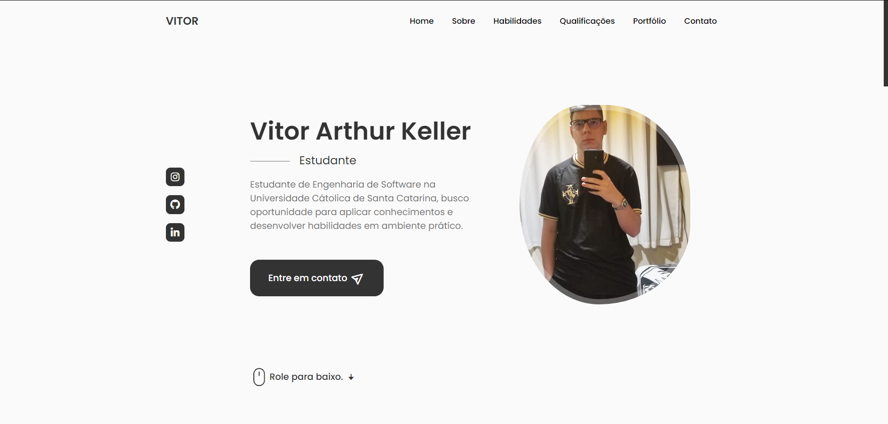

# Portfólio

## 🚀 Tecnologias

Esse projeto foi desenvolvido com as seguintes tecnologias:

## 💻 Projeto

- [Acesse o projeto finalizado, online](https://portfolio-vitorkeller.vercel.app/)

## 📜 Licença

Este projeto está licenciado sob a licença MIT. Consulte o arquivo [LICENSE](./LICENSE) para mais informações.

## 📌 Autor

Desenvolvido por **Vitor Arthur Keller** 🚀
