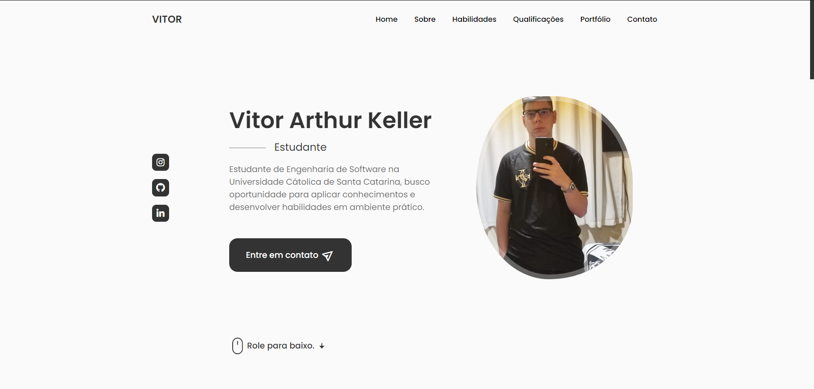

<h1 align="center"> Portfólio </h1>

  <a href="#-tecnologias">Tecnologias</a>&nbsp;&nbsp;&nbsp;|&nbsp;&nbsp;&nbsp;
  <a href="#-projeto">Projeto</a>&nbsp;&nbsp;&nbsp;|&nbsp;&nbsp;&nbsp;
  <a href="#memo-licença">Licença</a>

  

 

  

## 🚀 Tecnologias

Esse projeto foi desenvolvido com as seguintes tecnologias:

## 💻 Projeto

- [Acesse o projeto finalizado, online](https://vitorkeller.github.io/Portfolio/)

## :memo: Licença

Esse projeto está sob a licença MIT.

---

Feito por Vitor Arthur Keller :wave: